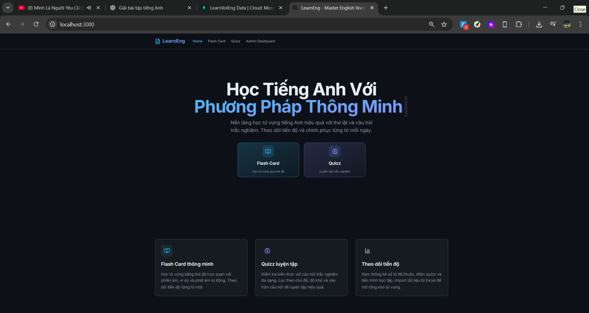
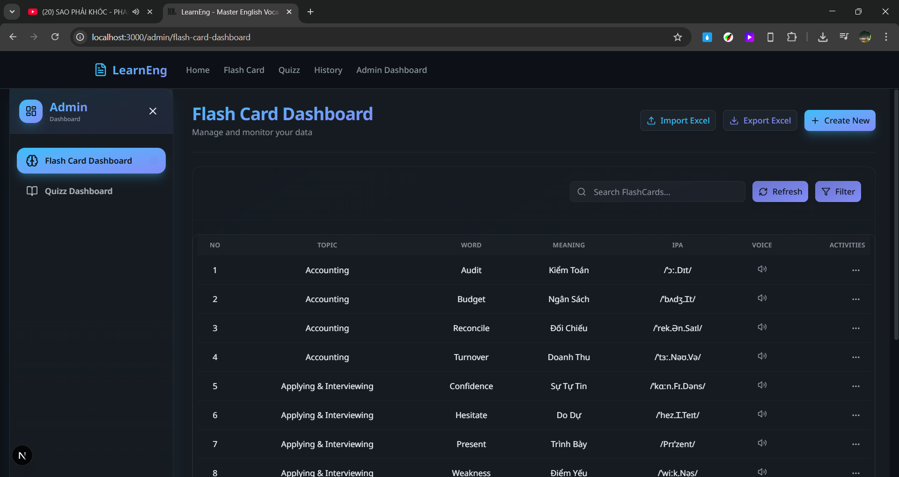
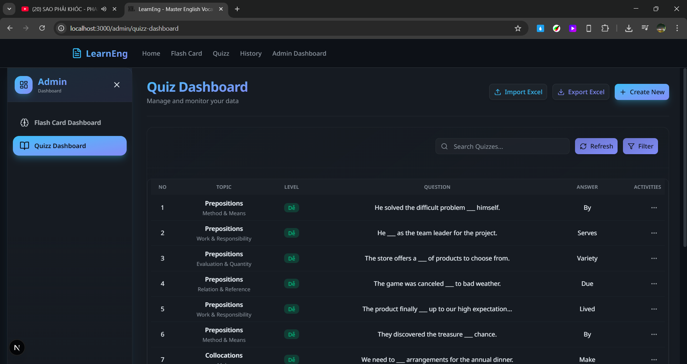
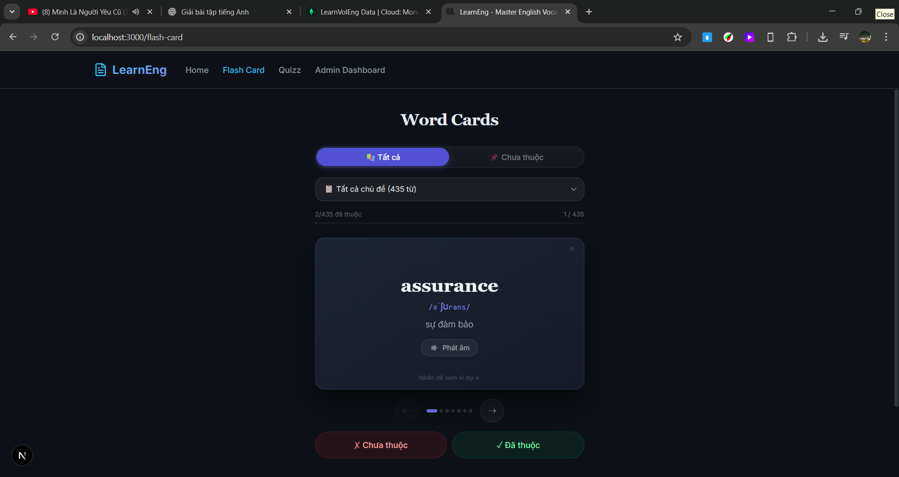
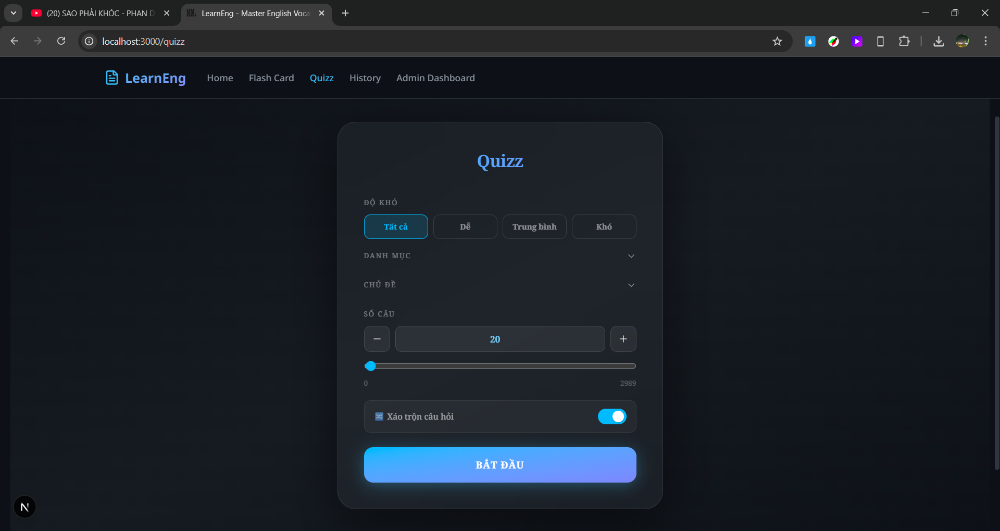
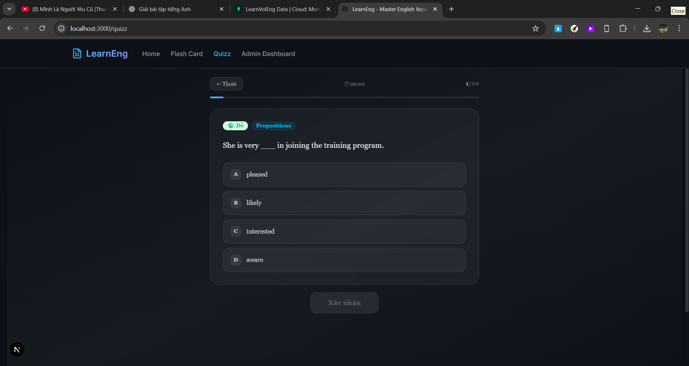
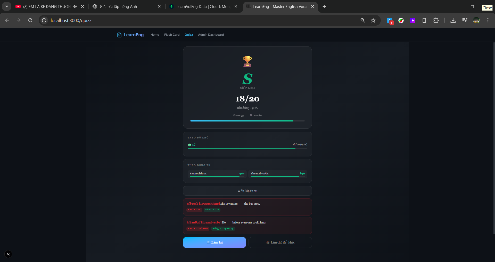
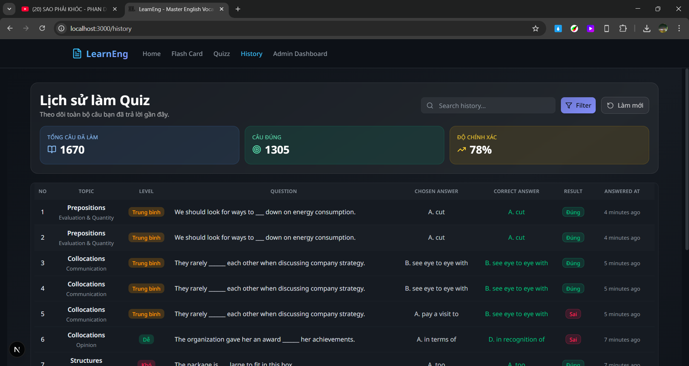

# LearnEng

English vocabulary learning platform built with Next.js, MongoDB, and TypeScript — featuring flash cards, quizzes, and progress tracking.

## Features

### Flash Cards

- Browse vocabulary by topic
- Flip-card UI with pronunciation (TTS & custom audio)
- Track memorized / unmemorized words
- Filter by "all" or "unlearned" mode

### Quizzes

- Multiple-choice questions with instant feedback
- Filter by topic and difficulty level
- Result history and score tracking

### Admin Dashboard

- CRUD flash cards and quizzes
- Import from Excel (.xlsx / .xls) via drag-and-drop
- Search, filter, and paginate data tables
- Dashboard stats overview

## Tech Stack

| Layer     | Technology                                  |
| --------- | ------------------------------------------- |
| Framework | Next.js 16 (App Router)                     |
| Language  | TypeScript 5                                |
| Styling   | Tailwind CSS 4, shadcn/ui                   |
| State     | Zustand, TanStack React Query               |
| Database  | MongoDB                                     |
| UI extras | Framer Motion, Lucide icons, React Toastify |
| Import    | xlsx (SheetJS)                              |
| Container | Docker (Node 20 Alpine + Puppeteer)         |

## Getting Started

### Prerequisites

- Node.js ≥ 20
- MongoDB instance (local or Atlas)

### Installation

```bash
# Clone the repository
git clone https://github.com/Hai1205/LearnEng.git
cd LearnEng

# Install dependencies
npm install

# Set up environment variables
cp .env.example .env
# Edit .env with your MongoDB URI
```

### Development

```bash
npm run dev          # http://localhost:3000
npm run dev:turbo    # with Turbopack
```

## Artwork

### Home Page



### Flash Card Dashboard Page



### Quizz Dashboard Page



### Flash Card Page



### Quizz Controller Page



### Quizz Question Page



### Quizz Result Page



### History Page



## Production

```bash
npm run build
npm run start
```

### Docker

```bash
docker build -t LearnEng .
docker run -p 3000:3000 --env-file .env LearnEng
```

## Project Structure

```
app/                  # Next.js App Router pages & API routes
  api/
    flash-cards/      # Flash card CRUD + import
    quizzes/          # Quiz CRUD + import
    quizz-results/    # Quiz result tracking
    vocabulary-progress/ # Vocabulary memorization tracking
    dashboard/stats/  # Dashboard statistics
  admin/              # Admin pages
  flash-card/         # Flash card learning page
  quizz/              # Quiz page
components/
  commons/            # Feature components (admin, flash-card, quizz, layout)
  ui/                 # shadcn/ui primitives
hooks/                # React Query hooks
stores/               # Zustand stores
types/                # TypeScript interfaces
lib/                  # Utilities & MongoDB connection
services/             # Constants & service config
```

## Environment Variables

| Variable                  | Description               |
| ------------------------- | ------------------------- |
| `NEXT_PUBLIC_SERVER_URL`  | Server base URL           |
| `NEXT_PUBLIC_MONGODB_URI` | MongoDB connection string |

## License

This project is for learning purposes.

- [Zustand Documentation](https://zustand-demo.pmnd.rs)

## 🤝 Contributing

1. Fork the repository
2. Create your feature branch (`git checkout -b feature/amazing-feature`)
3. Commit your changes (`git commit -m 'Add amazing feature'`)
4. Push to the branch (`git push origin feature/amazing-feature`)
5. Open a Pull Request

## 📄 License

This project is licensed under the MIT License - see the [LICENSE](../LICENSE) file for details.

## 💬 Support

For issues and questions:

- Open an issue on [GitHub](https://github.com/yourusername/MyBlog/issues)
- Check existing documentation in `/docs`

---

**Made with ❤️ by MyBlog Team**
